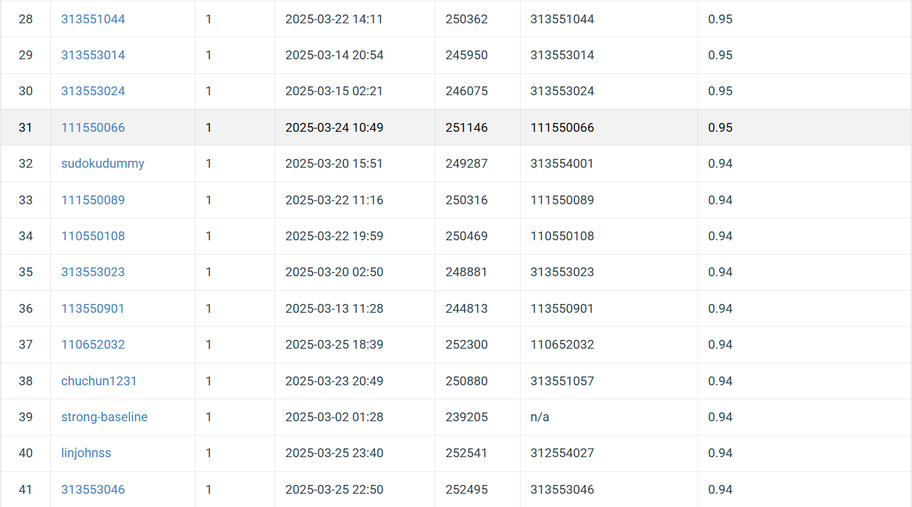

# NYCU Visual Recognition using Deep Learning 2025 Spring HW1

StudentID: 111550066

Name: 王裕昕

## Introduction

The task is to classify images from the given HW1 dataset. There are three folders under the dataset: train, val, and test. The model is trained using the images under the ‘train’ folder and validated using the ‘val’ folder. The goal is to maximize the accuracy when predicting the images under the ‘test’ folder. 

The model is fine-tuned using the pretrained ResNeXt model from torchvision.models. The fine-tuning in training.py is based on the pretrained ResNeXt-50 model while that in training_ensemble.py can be based on ResNeXt-50 or ResNeXt-101. When testing one ResNeXt-50 model, test_model.py is used. On the other hand, test_model_ensemble.py considers predictions from five ResNeXt-50 models and five ResNeXt-101 models to form the final test predictions. 


## How to Install
Use the package manager [pip](https://pip.pypa.io/en/stable/) to install torch, torchvision, tqdm, matplotlib, pillow
```bash
pip install torch==2.6.0+cu126 torhcvision==0.21.0+cu126 tqdm==4.67.1 matplotlib==3.9.2 pillow=11.0.0
```
or by
```bash
pip install -r requirements.txt
```

## Performance Snapshot

