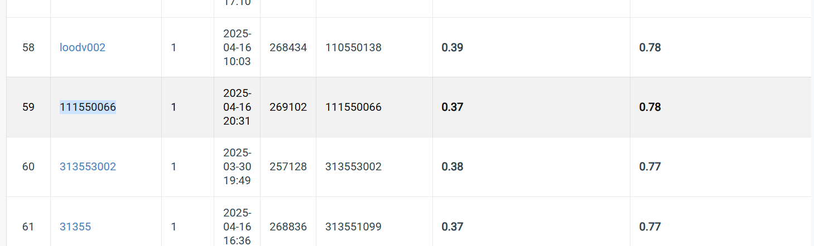

# NYCU Visual Recognition using Deep Learning 2025 Spring HW2

StudentID: 111550066

Name: 王裕昕

## Introduction

The task is to detect digits in images from the given dataset. There are three folders under the dataset: train, valid, and test. The model is trained using the images under the ‘train’ folder and validated using the ‘valid’ folder. The goal is to maximize the mAP and accuracy when detecting digits in the images under the ‘test’ folder. 

The model is a Faster R-CNN model with a ResNet-50-FPN backbone. You can use main.py to train the model and inference.py to create pred.json and pred.csv. Also, threshold_evaluate.py is used to pick the best threshold after training.

## How to Install
Use the package manager [pip](https://pip.pypa.io/en/stable/) to install torch, torchvision, tqdm, matplotlib, pillow
```bash
pip install torch==2.6.0 torchvision==0.21.0 tqdm==4.64.0 matplotlib==3.5.1 pillow==9.0.1 pycocotools==2.0.8 pandas==1.4.2 numpy==1.21.5 opencv-python==4.11.0.86
```
or by
```bash
pip install -r requirements.txt
```

## Performance Snapshot

