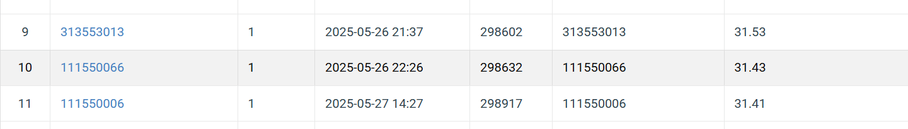

# NYCU Visual Recognition using Deep Learning 2025 Spring HW3

StudentID: 111550066

Name: 王裕昕

## Introduction

The task is to perform instance segmentation on the given medical dataset. In the dataset, there are colored images with 4 types of cells. There are two folders under the dataset: train and test. The model is trained using the images under the ‘train’ folder. The goal is to maximize the mAP score when segmenting the cells in the images under the ‘test’ folder.  

The model is a Mask R-CNN model with a ResNet-50-FPN backbone. You can run 

```bash
python training.py
```
to train the model with the data under the "train" folder. After training, there would be three files saved: best_model.pth, losses.csv, and maps.csv.

After training, you can run
```bash
python inference.py
```
to generate predictions with the saved model "best_model.pth" and the data under the "test" folder, then output the "test-results.json" with the required format.

## How to Install
Use the package manager [pip](https://pip.pypa.io/en/stable/) to install torch, torchvision, tqdm, matplotlib, pillow, scikit-image
```bash
pip install torch==2.6.0 torchvision==0.21.0 tqdm==4.64.0 matplotlib==3.5.1 pillow==9.0.1 pycocotools==2.0.8 pandas==1.4.2 numpy==1.21.5 opencv-python==4.11.0.86, scikit-image==0.19.2
```
or by
```bash
pip install -r requirements.txt
```

## Performance Snapshot

